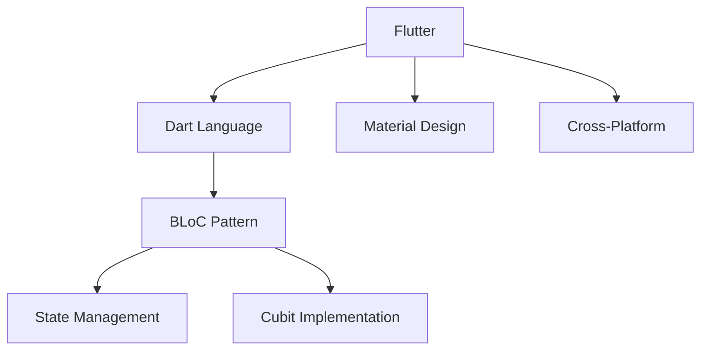

# 🫁 Lungora - AI-Powered Lung Health Assistant

<div align="center">
  
  
  
  
  
  
</div>

<div align="center">
  <h3>🫁 <em>Empowering Health Through AI Technology</em> 🚀</h3>
  <p>Revolutionary mobile app for intelligent lung health monitoring and medical consultation</p>
  <p><strong>🚧 Currently in Beta Version 🚧</strong></p>
</div>

---

## 📚 Table of Contents
- [📱 Overview](#-overview)
- [✨ Key Features](#-key-features)
- [🏗️ Architecture & Tech Stack](#️-architecture--tech-stack)
- [📸 App Workflows](#-app-workflows)
- [🚀 Getting Started](#-getting-started)
- [📁 Project Structure](#-project-structure)
- [🔧 Configuration](#-configuration)
- [🌟 Features in Detail](#-features-in-detail)
- [🛡️ Security & Privacy](#️-security--privacy)
- [📈 Performance](#-performance)
- [🤝 Contributing](#-contributing)
- [📄 License](#-license)
- [🔮 Roadmap](#-Roadmap-&-Future-Plans)

## 📱 Overview

**Lungora** is an innovative Flutter-based mobile application that revolutionizes lung health monitoring through artificial intelligence. The app combines cutting-edge AI technology with user-friendly design to provide comprehensive X-ray analysis, doctor consultations, and personalized health tracking.

### 🎥 Live Demo

<p align="center">
  
</p>

### 🎯 Mission
To make lung health monitoring accessible, accurate, and convenient for everyone through the power of AI and mobile technology.

### 📊 Project Status
- **🔨 Development Stage**: Beta Testing Phase
- **📱 Platform Support**: Android & iOS (Flutter)
- **🚀 Public Release**: Coming Soon
- **👥 Team Size**: Active development team
- **📈 Progress**: Core features implemented
- **🔄 Future Enhancements**: Planned features and improvements

## ✨ Key Features

<table>
<tr>
<td width="50%">

### 🤖 AI-Powered Diagnostics
- **Smart X-Ray Analysis** - Upload chest X-rays for instant AI diagnosis
- **Disease Detection** - COVID-19, Pneumonia, Normal classification
- **High Accuracy** - Advanced ML algorithms for reliable predictions
- **Image Processing** - Automatic validation and cropping tools

</td>
<td width="50%">

### 👨‍⚕️ Doctor Consultation
- **Location-Based Search** - Find nearby healthcare providers
- **Smart GPS Integration** - Automatic location detection
- **Comprehensive Profiles** - Detailed doctor information
- **Direct Communication** - Contact doctors seamlessly

</td>
</tr>
<tr>
<td width="50%">

### 🔐 Security & Authentication
- **Secure Login/Register** - Email and password authentication
- **OTP Verification** - Two-factor authentication
- **Password Management** - Reset and change functionality
- **Profile Management** - Complete user data control

</td>
<td width="50%">

### 📊 Health Monitoring
- **Real-time Analysis** - Instant AI-powered diagnosis
- **Detailed Reports** - Comprehensive health insights
- **Image Validation** - Quality check for uploaded X-rays


</td>
</tr>
</table>

### ⚙️ Additional Features
- **🎨 Theme Customization** - Light/Dark mode support
- **🔒 Privacy Controls** - Granular data management
- **🌍 Multi-Language** - Localization support (planned)
- **📱 Responsive Design** - Works perfectly on all screen sizes

### 🔮 Coming Soon Features
- **📜 Scan History** - Track and review all previous X-ray analyses
- **🔔 Smart Notifications** - Customizable push notifications and health reminders
- **📊 Progress Tracking** - Monitor health improvements over time
- **📈 Analytics Dashboard** - Detailed health insights and trends

---

## 🏗️ Architecture & Tech Stack

### **Frontend Framework**


| Technology | Purpose | Version |
|-----------|---------|---------|
| **Flutter** | Cross-platform mobile framework | ^3.0.0 |
| **Dart** | Programming language | Latest |
| **BLoC (Cubit)** | State management pattern | ^8.1.3 |
| **Go Router** | Advanced navigation system | ^12.1.1 |
| **ScreenUtil** | Responsive UI design | ^5.9.0 |

### **Backend Integration**
- **🌐 REST APIs** - Clean and scalable API architecture
- **📡 Dio HTTP Client** - Advanced networking with interceptors
- **🔑 JWT Authentication** - Secure token-based sessions
- **📤 FormData Handling** - Multipart file uploads for images

### **AI & Machine Learning**
- **🧠 Custom AI Model** - Trained specifically for lung disease detection
- **🖼️ Image Processing** - Advanced preprocessing and validation
- **⚡ Real-time Analysis** - Fast and accurate predictions
- **📏 Quality Validation** - File size and format checking

### **Services & Permissions**
- **📍 Location Services** - GPS integration with permission handling
- **📷 Camera Integration** - Native camera and gallery access
- **🔒 Secure Storage** - Encrypted local data storage
- **🌐 Network Security** - HTTPS and certificate pinning

---

## 📸 App Workflows

### 🔐 Authentication Flow
```
📱 App Launch → 🔐 Login/Register → 📧 OTP Verification → ✅ Dashboard Access
```

### 🫁 X-Ray Analysis Workflow
```
📷 Capture/Upload Image → ✂️ Crop & Validate Quality → 🤖 AI Processing & Analysis → 📊 Display Results & Recommendations → 💾 Generate & Save Medical Report
```

### 👨‍⚕️ Doctor Consultation Flow
```
📍 Location Request → 🗺️ Find Nearby Doctors → 👤 View Profiles & Reviews → 📞 Contact/Book Appointment
```

### ⚙️ Settings & Profile Flow
```
👤 Profile Access → ✏️ Edit Personal Information → 🔒 Security Settings → 💾 Save Changes
```

### 🔮 Future Workflows (Coming Soon)

#### 📜 History Management Flow
```
📊 Dashboard → 📜 View Scan History → 🔍 Search & Filter Results → 📈 Compare Previous Scans → 📤 Export Reports
```

#### 🔔 Notification System Flow
```
⚙️ Settings → 🔔 Notification Preferences → 📅 Set Health Reminders → 🔄 Sync with Calendar → 📱 Receive Smart Alerts
```

---

## 🚀 Getting Started

### 📋 Prerequisites
- **Flutter SDK** (Latest stable version)
- **Dart SDK** (Latest version)
- **IDE**: Android Studio / VS Code / IntelliJ
- **Git** for version control
- **Android/iOS Emulator** or physical device

### 🔧 Installation Steps

1. **📥 Clone the Repository**
```bash
git clone https://github.com/omarAbdullahMoharam/lungora.git
cd lungora
```

2. **📦 Install Dependencies**
```bash
flutter pub get
```

3. **🔧 Configure API Endpoints**
```dart
// lib/core/helpers/api_services.dart
const String baseUrl = "YOUR_API_BASE_URL";
```

4. **📱 Android Permissions Setup**
```xml
<!-- android/app/src/main/AndroidManifest.xml -->
<uses-permission android:name="android.permission.CAMERA" />
<uses-permission android:name="android.permission.ACCESS_FINE_LOCATION" />
<uses-permission android:name="android.permission.ACCESS_COARSE_LOCATION" />
<uses-permission android:name="android.permission.INTERNET" />
```

5. **🍎 iOS Permissions Setup**
```xml
<!-- ios/Runner/Info.plist -->
<key>NSCameraUsageDescription</key>
<string>This app needs camera access to capture X-ray images</string>
<key>NSLocationWhenInUseUsageDescription</key>
<string>This app needs location access to find nearby doctors</string>
```

6. **▶️ Run the Application**
```bash
# Development mode
flutter run

# Release mode
flutter run --release
```

---

## 📁 Project Structure

```
📦 lungora/
├── 📱 lib/
│   ├── 🎯 core/
│   │   ├── 🔧 helpers/
│   │   │   ├── 🌐 api_services.dart          # API endpoints
│   │   │   ├── 📍 location_service.dart       # GPS & permissions
│   │   │   ├── 📊 custom_snackbar.dart       # UI feedback
│   │   │   └── 💾 cache_helper.dart          # Local storage
│   │   ├── 🎨 utils/
│   │   │   ├── 🧭 app_router.dart            # Navigation
│   │   │   ├── 🎭 styles.dart                # UI themes
│   │   │   ├── 🔗 dependency_injection.dart  # DI container
│   │   │   └── 📐 constants.dart             # App constants
│   │   └── 🧩 widgets/
│   │       ├── 🔘 custom_elevated_button.dart
│   │       ├── 📝 custom_text_field.dart
│   │       └── 🔄 loading_widget.dart
│   ├── 🏠 features/
│   │   ├── 🔐 Auth/
│   │   │   ├── 📊 data/
│   │   │   │   ├── 🗂️ models/
│   │   │   │   └── 🏛️ repos/
│   │   │   ├── 🎭 presentation/
│   │   │   │   ├── 👁️ view/
│   │   │   │   ├── 🧠 view_model/
│   │   │   │   └── 🧩 widgets/
│   │   │   └── 🎯 domain/
│   │   ├── 👨‍⚕️ doctor/
│   │   │   ├── 📊 data/
│   │   │   ├── 🎭 presentation/
│   │   │   └── 🎯 domain/
│   │   ├── 🔍 Scan/
│   │   │   ├── 📊 data/
│   │   │   │   ├── 🗂️ models/
│   │   │   │   │   └── 🤖 ai_model_response.dart
│   │   │   │   └── 🏛️ repos/
│   │   │   ├── 🎭 presentation/
│   │   │   │   ├── 👁️ view/
│   │   │   │   ├── 🧠 view_model/
│   │   │   │   └── 🧩 widgets/
│   │   │   │       ├── 🖼️ build_image_preview.dart
│   │   │   │       ├── ⚠️ build_warning_banner.dart
│   │   │   │       └── 📋 build_selected_image_title.dart
│   │   │   └── 🎯 domain/
│   │   └── ⚙️ Settings/
│   │       ├── 📊 data/
│   │       ├── 🎭 presentation/
│   │       └── 🎯 domain/
│   └── 🎯 main.dart
├── 🎨 assets/
│   ├── 🖼️ images/
│   ├── 🎭 icons/
│   └── 🔤 fonts/
├── 🤖 android/
├── 🍎 ios/
└── 📝 pubspec.yaml
```

---

## 🔧 Configuration

### 🌐 API Endpoints Configuration

```dart
// lib/core/helpers/api_services.dart
abstract class ApiServices {
  // Authentication
  @POST("api/Auth/Login")
  Future<AuthResponse> login(@Body() Map<String, dynamic> body);
  
  @POST("api/Auth/Register")
  Future<AuthResponse> register(@Body() Map<String, dynamic> body);
  
  @POST("api/Auth/VerifyOTP")
  Future<AuthResponse> verifyOTP(@Body() Map<String, dynamic> body);
  
  // AI Model
  @POST("api/ModelAI/AI_Model")
  Future<AiModelResponse> getAIModel(@Part() FormData formData);
  
  // Doctor Services
  @GET("api/Doctor/GetAllDoctors")
  Future<DoctorsResponse> getAllDoctors();
  
  // User Management
  @GET("api/Auth/GetDataUser")
  Future<UserDataResponseModel> getUserData(@Header("Authorization") String token);
}
```

### 📦 Dependencies (pubspec.yaml)

```yaml
dependencies:
  flutter: ^3.0.0
  
  # State Management
  flutter_bloc: ^8.1.3
  
  # Navigation
  go_router: ^12.1.1
  
  # Networking
  dio: ^5.3.2
  retrofit: ^4.0.3
  
  # Image Handling
  image_picker: ^1.0.4
  image_cropper: ^5.0.1
  
  # Permissions
  permission_handler: ^11.0.1
  
  # Location
  geolocator: ^9.0.2
  
  # UI & Responsiveness
  flutter_screenutil: ^5.9.0
  flutter_svg: ^2.0.7
  
  # Utilities
  fluttertoast: ^8.2.2
  shared_preferences: ^2.2.0
  
dev_dependencies:
  flutter_test: ^3.0.0
  build_runner: ^2.4.6
  retrofit_generator: ^8.0.4
  json_annotation: ^4.8.1
  json_serializable: ^6.7.1
```

---

## 🌟 Features in Detail

### 🤖 AI-Powered X-Ray Analysis

<details>
<summary><strong>Click to expand detailed features</strong></summary>

#### 📋 Capabilities
- **Multi-Disease Detection**: COVID-19, Pneumonia, Normal lung classification
- **High Accuracy Model**: Custom-trained AI with medical imaging datasets
- **Real-time Processing**: Analysis completed in seconds
- **Quality Validation**: Automatic image quality assessment

#### 🔧 Technical Implementation
```dart
// Example AI Model Integration
Future<AiModelResponse> analyzeXRay(File imageFile) async {
  final formData = FormData.fromMap({
    'image': await MultipartFile.fromFile(imageFile.path),
  });
  
  return await apiService.getAIModel(formData);
}
```

#### 📊 Supported Classifications
- **COVID-19**: Detection of COVID-related lung patterns
- **Pneumonia**: Identification of pneumonia indicators
- **Normal**: Healthy lung classification
- **Quality Check**: Image clarity and positioning validation

</details>

### 📍 Location-Based Doctor Discovery

<details>
<summary><strong>Click to expand location features</strong></summary>

#### 🗺️ Location Services
- **GPS Integration**: Automatic location detection
- **Permission Handling**: Smart permission request flows
- **Offline Support**: Cached location data
- **Privacy Protection**: Location data handled securely

#### 👨‍⚕️ Doctor Discovery
- **Proximity Search**: Find doctors within specified radius
- **Filter Options**: Specialty, rating, availability
- **Detailed Profiles**: Reviews, contact info, expertise
- **Direct Communication**: Call, message, or book appointments

</details>

### 🔐 Security & Authentication

<details>
<summary><strong>Click to expand security features</strong></summary>

#### 🛡️ Authentication Methods
- **Email/Password**: Standard login with validation
- **OTP Verification**: SMS/Email two-factor authentication
- **Biometric Login**: Fingerprint/Face ID support (planned)
- **Social Login**: Google/Facebook integration (planned)

#### 🔒 Data Protection
- **JWT Tokens**: Secure session management
- **Encrypted Storage**: Local data encryption
- **API Security**: HTTPS with certificate pinning
- **Privacy Controls**: Granular data permissions

</details>

---

## 🛡️ Security & Privacy

### 🔐 Data Protection Measures

| Security Layer | Implementation | Description |
|---------------|----------------|-------------|
| **🌐 Network** | HTTPS + Certificate Pinning | All API calls encrypted in transit |
| **🔑 Authentication** | JWT + Refresh Tokens | Secure session management |
| **💾 Storage** | AES Encryption | Local data encrypted at rest |
| **🔒 Permissions** | Runtime Requests | Granular permission controls |
| **🛡️ Privacy** | Data Minimization | Only necessary data collected |

### 🔒 Privacy Compliance
- **GDPR Ready**: European data protection compliance
- **HIPAA Considerations**: Healthcare data handling best practices
- **User Control**: Complete data management options
- **Transparency**: Clear privacy policy and data usage

---

## 📈 Performance Optimizations

### ⚡ Speed & Efficiency

| Optimization | Benefit | Implementation |
|-------------|---------|----------------|
| **🔄 Lazy Loading** | Faster startup | Widget lazy initialization |
| **💾 Smart Caching** | Reduced API calls | Intelligent data caching |
| **🖼️ Image Optimization** | Faster loading | Automatic image compression |
| **📱 Memory Management** | Smooth performance | Efficient resource usage |

### 📊 Performance Metrics
- **🚀 App Launch**: < 3 seconds cold start
- **⚡ Navigation**: Instant page transitions
- **🔄 API Response**: < 2 seconds average
- **💾 Memory Usage**: Optimized for low-end devices

---

## 🤝 Contributing

We welcome contributions from the community! Here's how you can help:

### 🚀 Getting Involved

1. **🍴 Fork the Repository**
```bash
git fork https://github.com/omarAbdullahMoharam/lungora.git
```

2. **🌿 Create Feature Branch**
```bash
git checkout -b feature/amazing-new-feature
```

3. **💾 Commit Changes**
```bash
git commit -m "Add amazing new feature"
```

4. **📤 Push to Branch**
```bash
git push origin feature/amazing-new-feature
```

5. **🔄 Open Pull Request**

### 📝 Development Guidelines

#### 🎯 Code Standards
- **📏 Style Guide**: Follow official Dart/Flutter style guide
- **🏗️ Architecture**: Use BLoC pattern for state management
- **🧪 Testing**: Write unit and widget tests
- **📚 Documentation**: Update docs for new features

#### 🔍 Code Review Process
- **✅ Automated Tests**: All tests must pass
- **👥 Peer Review**: Minimum 2 reviewer approvals
- **🚀 Performance**: No performance regressions
- **📱 Platform Testing**: Test on both Android and iOS

### 🐛 Bug Reports
Use our issue template and include:
- **📱 Device Information**
- **🔄 Steps to Reproduce**
- **📊 Expected vs Actual Behavior**
- **📸 Screenshots/Logs**

---

## 📄 License

This project is licensed under the **MIT License** - see the [LICENSE](LICENSE) file for details.

### 📋 License Summary
- ✅ **Commercial Use**: Allowed
- ✅ **Modification**: Allowed
- ✅ **Distribution**: Allowed
- ✅ **Private Use**: Allowed
- ❌ **Liability**: Not provided
- ❌ **Warranty**: Not provided

---

## 👥 Team & Credits

### 🏆 Core Team

| Role | Responsibility | Skills |
|------|---------------|--------|
| **🎨 Mobile Lead** | Flutter/Dart Development | UI/UX, State Management |
| **🌐 Web Frontend Engineer** | Web App Interface (Admin Dashboard) | React, HTML/CSS, JavaScript |
| **🔧 Backend Engineer** | API & Database | REST APIs, Security |
| **🤖 AI Engineer** | ML Model Development | TensorFlow, Medical Imaging |
| **🎭 UI/UX Designer** | User Experience | Design Systems, Prototyping |
| **🔒 Security Expert** | Data Protection | Encryption, Compliance |


### 🙏 Acknowledgments
- **Medical Consultants** for domain expertise
- **Flutter Community** for packages and support
- **Open Source Contributors** for making this possible

---

## 🔮 Roadmap & Future Plans

### 📅 Phase 1 - Beta Release (Current)
- [x] **🤖 Core AI Model** - Basic disease detection functionality
- [x] **🔐 Authentication System** - Secure login/register with OTP
- [x] **📱 Mobile App** - Flutter cross-platform application
- [x] **👨‍⚕️ Doctor Discovery** - Location-based doctor search
- [x] **🖼️ Image Processing** - X-ray upload, validation, and cropping
- [ ] **🧪 Beta Testing** - Internal testing and bug fixes

### 📅 Phase 2 - Enhanced Core Features (Q2 2024)
- [ ] **📜 Scan History Management** - Complete history tracking system
  - [ ] View all previous X-ray scans and results
  - [ ] Search and filter scan history by date/type
  - [ ] Compare multiple scans over time
  - [ ] Export individual or batch reports
- [ ] **🔔 Smart Notification System** - Comprehensive notification features
  - [ ] Health reminders and follow-up notifications
  - [ ] Scan result alerts and recommendations
  - [ ] Appointment reminders with doctors
  - [ ] Customizable notification preferences
- [ ] **📊 Progress Tracking** - Health monitoring dashboard
  - [ ] Visual charts showing health progress
  - [ ] Trend analysis of scan results
  - [ ] Health improvement recommendations

### 📅 Phase 3 - Public Launch (Q3 2024)
- [ ] **🚀 App Store Release** - Google Play & App Store deployment
- [ ] **🎯 Enhanced AI Accuracy** - Improved model with larger medical dataset
- [ ] **📱 Progressive Web App** - Web version for broader accessibility
- [ ] **🌍 Multi-Language Support** - 5+ language translations
- [ ] **📈 Analytics Dashboard** - Detailed health insights and metrics

### 📅 Phase 4 - Advanced Features (Q1 2025)
- [ ] **📱 Telemedicine Integration** - Video consultations with doctors
- [ ] **⌚ Wearable Integration** - Apple Watch/WearOS support
- [ ] **💊 Medication Tracking** - Prescription and treatment management
- [ ] **🤝 Social Features** - Community health discussions and support

### 📅 Phase 5 - Innovation (Q3 2025)
- [ ] **🥽 AR Visualization** - 3D X-ray analysis with Augmented Reality
- [ ] **🧬 Genetic Integration** - Personalized risk assessment based on genetics
- [ ] **🌐 Global Health Network** - International doctor and hospital network
- [ ] **🤖 Advanced AI** - Multi-modal medical analysis (X-ray + symptoms + history)

---

## 📞 Support & Contact

### 🛟 Getting Help

| Channel | Purpose | Response Time |
|---------|---------|---------------|
| **💬 WhatsApp Group** | [Join Community Chat](https://chat.whatsapp.com/IaoL5aRe3N70ZD87X1o7oT) | Real-time |
| **🎮 Discord Server** | [Join Discord](https://discord.gg/7r43zrGt) | Real-time |
| **🐛 GitHub Issues** | Bug reports & feature requests | 24-48 hours |
| **📧 Direct Contact** | Technical discussions | Via Discord/WhatsApp |

### 💬 Community Guidelines
- **🤝 Be Respectful**: Treat all members with kindness
- **🎯 Stay On Topic**: Keep discussions relevant to Lungora
- **🐛 Report Bugs**: Use GitHub issues for bug reports
- **💡 Share Ideas**: Feature suggestions are welcome
- **🚫 No Spam**: Keep promotional content to minimum

### 🌐 Project Links
- **📂 GitHub Repository**: [omarAbdullahMoharam/lungora](https://github.com/omarAbdullahMoharam/lungora)
- **📋 Project Board**: [GitHub Projects](https://github.com/omarAbdullahMoharam/lungora/projects)
- **🐛 Issue Tracker**: [GitHub Issues](https://github.com/omarAbdullahMoharam/lungora/issues)
- **📖 Documentation**: [GitHub Wiki](https://github.com/omarAbdullahMoharam/lungora/wiki)

---

<div align="center">
  
### ⭐ Star this Repository
**If Lungora helped you or you find it interesting, please give it a star!**

[](https://github.com/omarAbdullahMoharam/lungora/stargazers)
[](https://github.com/omarAbdullahMoharam/lungora/network)
[](https://github.com/omarAbdullahMoharam/lungora/watchers)

---

### 🚧 Development Status: Active Development 🚧

**🔨 Currently in Beta Testing Phase**  
**📱 Public Release Coming Soon**

---

<h2>🫁 Made with ❤️ by the Lungora Team</h2>
<h3><em>"YOUR Health IS OUR MISSION"</em></h3>

**🚀 Together, we're building the future of digital healthcare 🏥**

</div>
